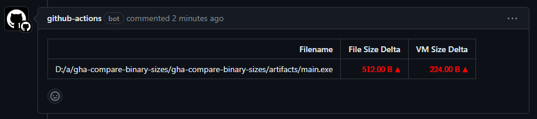

# Compare binary sizes workflow

These workflows display a pull request's impact on the size of one or more binary files.



## Overview

This project exports two callable workflows that must be used together:

- `snapshot-binary-sizes` runs against a project's `main` branch and caches
information about a binary's on-disk and in-memory segment sizes.
- `compare-binary-sizes` runs against pull requests for the `main` branch and
compares the binary's new segment sizes with the cached values.

## Usage

1. Create a workflow `.yml` file in your repository's `.github/workflows` directory.
This workflow should build your project and upload the artifacts you want to
compare. Then it should call the `snapshot-binary-sizes` workflow. This workflow
should be triggered on [push events](https://docs.github.com/en/actions/using-workflows/events-that-trigger-workflows#push)
to your main branch

2. Create a second workflow `.yml` file which also builds your project, uploads the
artifacts you want to compare, then calls the `compare-binary-sizes` workflow. This
workflow should be triggered on [pull_request events](https://docs.github.com/en/actions/using-workflows/events-that-trigger-workflows#pull_request) to the main branch.

An [example workflow](#example-workflow) is available below. For more
information about creating workflows, see the GitHub Help Documentation.

> [!NOTE]
> - You can also use any branch other than `main` as long as both workflows are triggered.
> - The files inside the artifact that you upload to this workflow should use the same
>   filesystem layout each time the workflow is called, to ensure files are diffed correctly.

## Example workflows

Below is an example workflow that calls `snapshot-binary-sizes`:

```yml
name: Example snapshot binary sizes

on:
  push:
    branches:
      - 'main'

jobs:
  build:
    name: Build artifacts to snapshot
    runs-on: windows-latest
    steps:
      - name: Checkout
        uses: actions/checkout@v4

      - name: Build main
        run: |
          New-Item -ItemType directory build
          gcc test/main.c -o build/main

      - name: Upload artifacts
        uses: actions/upload-artifact@v4
        with:
          name: binaries
          path: build

  snapshot_binary_sizes:
    name: Snapshot binary sizes
    needs: [build]
    uses: kendalharland/gha-compare-binary-sizes/.github/workflows/snapshot-binary-sizes.yml
    with:
      artifact: binaries
```

And here is the corresponding workflow to call `compare-binary-sizes`:

```yml
name: Example compare binary sizes

on:
  pull_request:
  
jobs:
  build:
    name: Build artifacts to compare
    runs-on: windows-latest
    steps:
      - name: Checkout
        uses: actions/checkout@v4

      - name: Build main
        run: |
          New-Item -ItemType directory build
          gcc test/main.c -o build/main

      - name: Upload artifacts to compare
        uses: actions/upload-artifact@v4
        with:
          name: binaries
          path: build

  compare_binary_sizes:
    name: Compare binary sizes
    needs: [build]
    uses: kendalharland/gha-compare-binary-sizes/.github/workflows/compare-binary-sizes.yml
    with:
      artifact: binaries
```

## Prerequisites

- The `compare-binary-sizes` workflow needs `issues: write` permission to
  comment on pull requests. Either give `$GITHUB_TOKEN` read/write permissions
  by following [this guide][#github-token-guide], or provide a token with these
  permissions using the workflow input `token`.

## Limitations

### Platform support

- [x] Windows
- [ ] Linux
- [ ] MacOS

See the [contributing](#contributing) section if you'd like to support to another platform.

### Binary file format support

- [x] PE/COFF (.exe, .dll)
- [x] ELF
- [x] Mach-O
- [x] WebAssembly

See the [contributing](#contributing) section if you'd like to support another format.

### Cache size and retention

These workflows use the [Github Action Cache](https://github.com/actions/cache) to share
binary size information between workfow runs. This means that the size information is
subject to Github's cache retention policies.

## Contributing

Pull requests are welcome!

> [!TODO]
> Add a contributing guide

## License

The scripts and documentation in this project are released under the MIT License


[github-token-guide]: https://docs.github.com/en/repositories/managing-your-repositorys-settings-and-features/enabling-features-for-your-repository/managing-github-actions-settings-for-a-repository#setting-the-permissions-of-the-github_token-for-your-repository